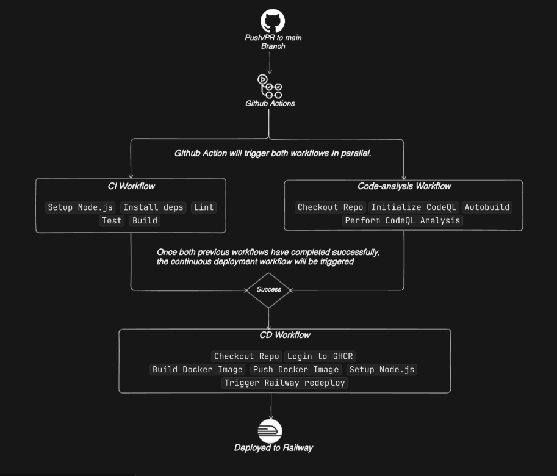

# Better Assessment

## CI/CD Pipeline Overview

The project follows a structured CI/CD pipeline using GitHub Actions. The pipeline ensures code quality, security analysis, and automatic deployment to Railway.

### Pipeline Description

1. **Trigger**
   - The pipeline is triggered on every push or pull request to the `main` branch.

2. **Parallel Workflows**
   - **CI Workflow**
     - Setup Node.js
     - Install dependencies
     - Lint the code
     - Run tests
     - Build the application
   - **Code Analysis Workflow**
     - Checkout repository
     - Initialize CodeQL
     - Autobuild
     - Perform CodeQL security analysis

3. **Continuous Deployment (CD)**
   - Once both the CI and CodeQL workflows complete successfully, the CD workflow is triggered:
     - Checkout repository
     - Login to GitHub Container Registry (GHCR)
     - Build Docker image
     - Push Docker image to GHCR
     - Setup Node.js
     - Trigger Railway deployment
   - The application is then automatically deployed to Railway.

### Notes
- CI and CodeQL workflows run in **parallel**.
- CD workflow runs **only if both CI and CodeQL workflows succeed**.
- The image above is visually representing the pipeline.

### Thanks for reading so far! 🚀
